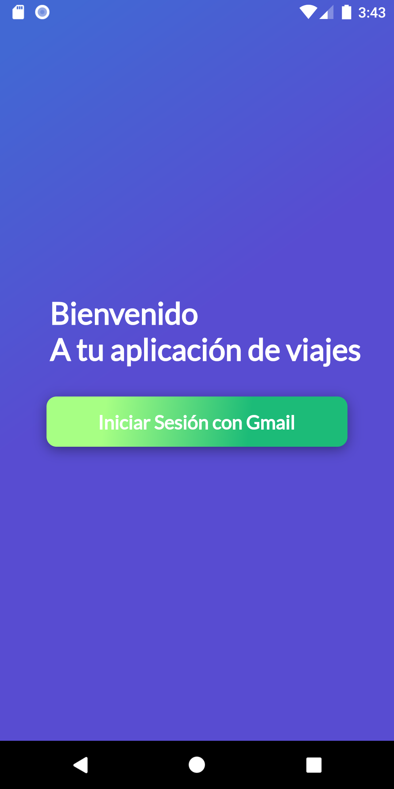
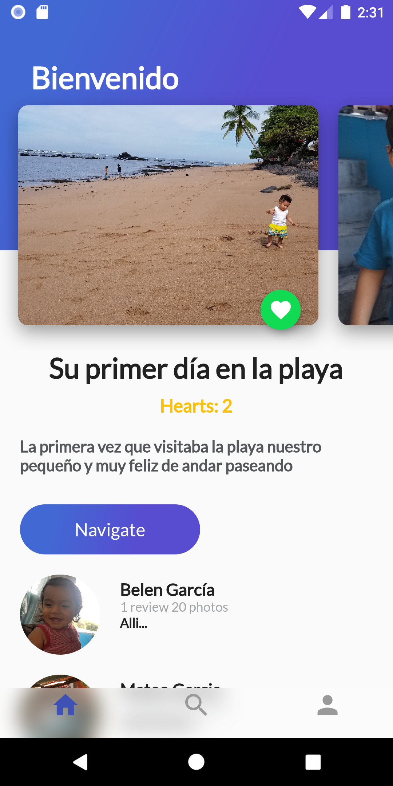
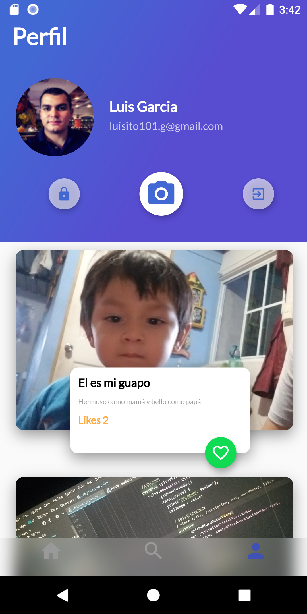
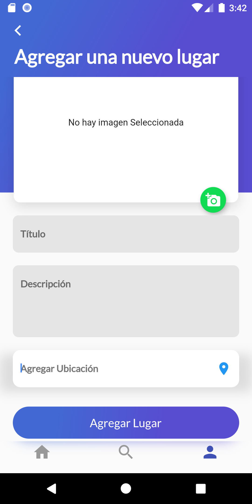

# fluttertrips

Primera Aplicacion usando Framework Flutter, la cual consiste en una aplicación para subir fotografías de lugares y poder dar me gusta y comentar, se implementó autenticación con Google a través de Firebase, se dió persistencia a nuestros datos usando la base de datos Realtime de Cloud Firestore, se aprendió a manejar al hardware en iOS y Android accediendo a la cámara o galería del dispositivo, capturando fotos y después subirlas al Firebase Storage.  

# Capturas de Pantalla

 

  

# Librerias Utilizadas

* **BLoC** - Libreria de arquitectura para desarrollo de aplicaciones en Flutter.
* **Firebase Auth** - Para autenticación administrada por Firebase
* **Google SigIn** - Para auntenticación por medio de la cuenta de Gmail.
* **Firebase Storage** - Almancenamiento de las fotografías cargadas en la aplicación.
* **Cloud Firestore** - Para persistencia de datos utilizando la base de datos realtime.
* **Image Picker** - Libreria de acceso al Hardware de la camará o galeria del dispositivo.

A few resources to get you started if this is your first Flutter project:

- [Lab: Write your first Flutter app](https://flutter.dev/docs/get-started/codelab)
- [Cookbook: Useful Flutter samples](https://flutter.dev/docs/cookbook)

For help getting started with Flutter, view our
[online documentation](https://flutter.dev/docs), which offers tutorials,
samples, guidance on mobile development, and a full API reference.
